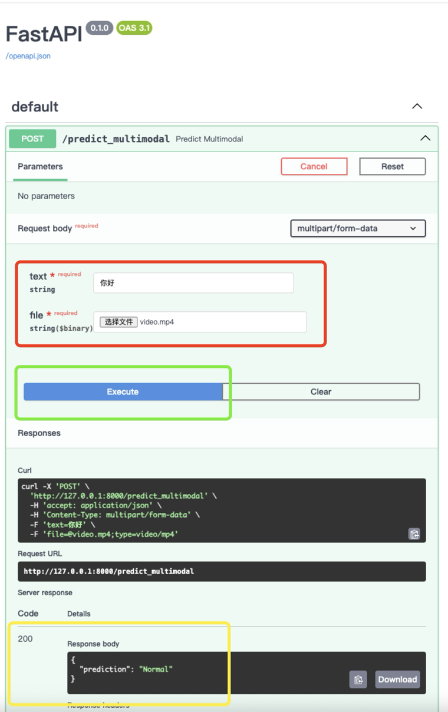
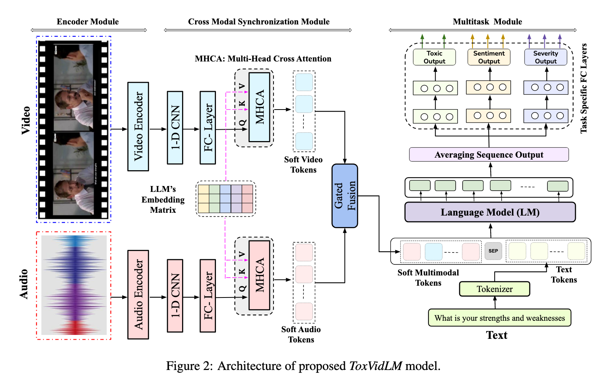

# 多模态敏感内容检测（视频，音频，文本）
## 👀 使用方法
- 👇🏻 进入文件夹后，在终端输入以下命令
```bash 
uvicorn app:app --host 0.0.0.0 --port 8000
```
- ✌🏻 出现以下内容代表运行成功
```bash 
INFO:     Started server process [91412]
INFO:     Waiting for application startup.
INFO:     Application startup complete.
INFO:     Uvicorn running on http://0.0.0.0:8000 (Press CTRL+C to quit)
```
- 💁🏻 点击链接，浏览器会出现以下页面，在**红框内输入文字上传视频，点击绿框内的Execute运行，最后在黄框内查看结果**

## 👏🏻 测试数据
- 数据集来源 MultiHateClip 【Chinese】（1000videos from bilibili）
    - 存在数据缺失的情况（爬不到原始视频）
    - 现存数据量
        - train：624
        - valid：91
        - test：175
- Videos内的train，test，valid文件夹储存的是原视频，**使用api时请使用原视频**

- train2，test2，valid2文件夹内储存的是经过预处理的视频，训练时使用，以提升训练及测试速度，避免重复操作

- MultiHateClip/Chinese_data/test_data.csv 内包含如下字段 
    - Video_ID --------------------------- 唯一ID，可用于查询视频及音频位置
    - Majority_Voting -------------------- 原始标签，0代表Normal，1代表Offensive
    - title,description,transcript ---------- 合并起来，作为文字输入
    - video_path,audio_path -------------- 储存视频及音频的路径，注意使用api时视频路径需替换

## 👀 方法路线
- ToxVidLM （ACL 2024 Findings）



## 仓库目录
```
├── README.md           # 项目说明
├── requirements.txt    # 依赖
├── app.py              # api接口
├── code/               # 源码
├── models/             # Embedding 模型
│   ├── chinese-roberta-wwm-ext/    
│   ├── videomae_base/  
│   ├── whisper_small/ 
├── checkpoints/        # Multimodal模型
│   ├── multi3_model.pth/     
└── MultiHateClip/      # 文本数据
└── Videos/             # 视频数据
```
### Note：code内的train.py test.py 文件，由于模型文件路径变动等原因，可能会出现报错，待调整，复现教程待更新😁
## 参考文献
[1] K. Maity, A. S. Poornash, S. Saha, and P. Bhattacharyya, “ToxVidLM: A multimodal framework for toxicity detection in code-mixed videos,” July 14, 2024, arXiv: arXiv:2405.20628. doi: 10.48550/arXiv.2405.20628.

[2] H. Wang, T. R. Yang, U. Naseem, and R. K.-W. Lee, “MultiHateClip: A multilingual benchmark dataset for hateful video detection on YouTube and bilibili,” in Proceedings of the 32nd ACM International Conference on Multimedia, Oct. 2024, pp. 7493–7502. doi: 10.1145/3664647.3681521.
